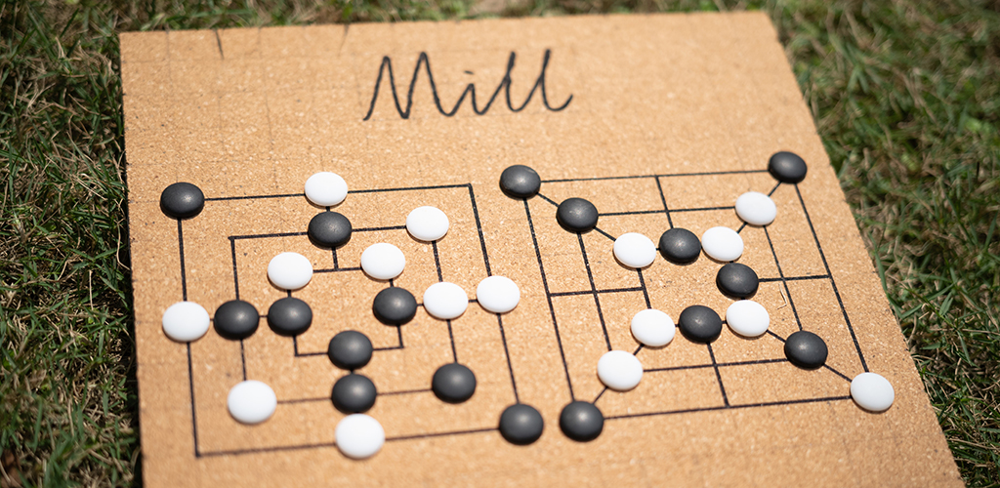

## Overview

[](https://www.youtube.com/channel/UCbGKXwhh1DkuINyZw05kyHw/featured)

<a href="https://github.com/calcitem/Sanmill/actions/workflows/flutter.yml?query=branch%3Amaster+is%3Asuccess+event%3Apush" target="_blank">
</a>

<a href="https://f-droid.org/packages/com.calcitem.sanmill/" target="_blank">
</a>

<a href="https://play.google.com/store/apps/details?id=com.calcitem.sanmill" target="_blank">
</a>

<a href="https://cafebazaar.ir/app/com.calcitem.sanmill" target="_blank">
</a>

[](https://ci.appveyor.com/project/Calcitem/Sanmill/branch/master)
[](https://www.codacy.com/gh/calcitem/Sanmill/dashboard?utm_source=github.com&amp;utm_medium=referral&amp;utm_content=calcitem/Sanmill&amp;utm_campaign=Badge_Grade)

[Sanmill](https://github.com/calcitem/Sanmill) is a free, powerful UCI-like N men's morris program with CUI, Flutter GUI and Qt GUI.

[**Nine men's morris**](https://en.wikipedia.org/wiki/Nine_men%27s_morris) is a [strategy](https://en.wikipedia.org/wiki/Abstract_strategy_game) [board game](https://en.wikipedia.org/wiki/Board_games) for two players dating at least to the [Roman Empire](https://en.wikipedia.org/wiki/Roman_Empire). The game is also known as **nine-man morris**, **mill**, **mills**, **the mill game**, **merels**, **merrills**, **merelles**, **marelles**, **morelles**, and **ninepenny marl** in English.


## Files

This distribution of Sanmill consists of the following files:

* Readme.md, the file you are currently reading.

* Copying.txt, a text file containing the GNU General Public License version 3.

* src, a subdirectory containing the full source code, including a Makefile that can be used to compile Sanmill CUI on Unix-like systems.

* src/ui/flutter_app, a subdirectory containing a Flutter frontend.

* src/ui/qt, a subdirectory containing a Qt frontend.

## How to Build

### CUI

Sanmill CUI has support for 32 or 64-bit CPUs, certain hardware instructions, big-endian machines such as Power PC, and other platforms.

On Unix-like systems, it should be easy to compile Sanmill directly from the source code with the included Makefile in the folder `src`. In general it is recommended to run `make help` to see a list of make targets with corresponding descriptions.

```shell
cd src
make help
make build ARCH=x86-64-modern
```

When reporting an issue or a bug, please tell us which version and compiler you used to create your executable. These information can be found by typing the following commands in a console:

```shell
./sanmill compiler
```

### Qt Application

If you have started using Ubuntu or any Ubuntu-based Linux distribution, you must install Qt by running the following command as root:

```shell
sudo apt-get install qt5-default qtmultimedia5-dev qtcreator
```

Use Qt Creator to open `millgame.pro` , or use Visual Studio to open `millgame.sln` to build Qt Application.

### Flutter App

Run `./flutter-init.sh` , copy `src/ui/flutter_app/android/key.properties.example` to `src/ui/flutter_app/android/key.properties`, modify it, and then use Android Studio or  Visual Studio Code to open `src/ui/flutter_app` to build Flutter App.

## Understanding the code base and participating in the project

Sanmill's improvement over the last couple of years has been a great community effort. There are a few ways to help contribute to its growth.

### Improving the code

If you want to help improve the code, there are several valuable resources:

* [In this wiki,](https://github.com/calcitem/Sanmill/wiki) many techniques used in Sanmill are explained with a lot of background information.

* The latest source can always be found on [GitHub](https://github.com/calcitem/Sanmill).

* Discussions about Sanmill take place in the [Discussions](https://github.com/calcitem/Sanmill/discussions).

## Terms of use

Sanmill is free, and distributed under the **GNU General Public License version 3**
(GPL v3). Essentially, this means you are free to do almost exactly
what you want with the program, including distributing it among your
friends, making it available for download from your website, selling
it (either by itself or as part of some bigger software package), or
using it as the starting point for a software project of your own.

The only real limitation is that whenever you distribute Sanmill in
some way, you must always include the full source code, or a pointer
to where the source code can be found. If you make any changes to the
source code, these changes must also be made available under the GPL.

For full details, read the copy of the GPL v3 found in the file named
*Copying.txt*.
